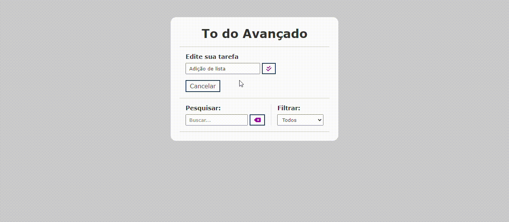

# Projeto to-do-list
Esse projeto foi feito durante a aula de Programação Web 1 sobre o auxilio do Professor Leonardo Santiago. O projeto se consiste em uma to do list. Com referência no vídeo "Projeto de JavaScript para iniciantes - To Do List com JavaScript puro" que está disponivel no Youtube.

## Descrição 
O site apresenta um css simples com um background cinza, centralizado é possível ver uma tela branca aonde está a to do list; nessa parte central do site é a parte principal do projeto, aonde pode ser feitos as coisas descritas na categorias de "Função" aqui no README.

## Função
A lista tem a função de poder adicionar tarefas e poder editar, completar, buscar tarefas, filtrar e excluir. Sendo muito útil para pessoas que necessitam de algum lugar para salvar seus trabalhos, e determinar tarefas que devem ser feitas.

## Tecnologias utilizadas 
* ``HTML 5``
* ``CSS 3``
* ``Java Script``
* ``Github``
* ``VsCode``
* ``Microsoft Teams``
* ``Youtube``

## Autores
Matheus Battisti (Criador do projeto)
Kleyverson de Oliveira Sampaio 